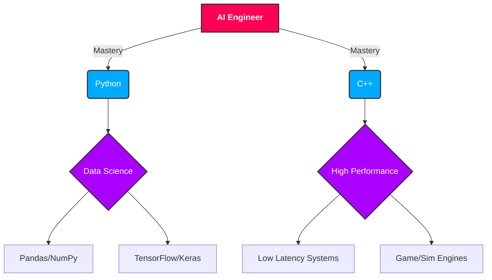

# < Shailendra />

### `> initiating_protocol: PROFILE_VIEW`
### `> access_level: PUBLIC`
### `> user_detected: SHAILENDRA KUMAR SAHU`
### `> role: AI Engineer | DevOps | Software Architect`
### `> status: ONLINE`

 

---

## 📟 System Status

> "Crafting intelligent systems from the kernel up."

I am a passionate engineer from **India**, currently optimizing algorithms and deploying scalable AI solutions. My core functions include **Data Structures**, **Algorithms**, and **Machine Learning**. I build robust digital architectures that solve real-world problems.

- 🌱 **Current Operation**: Mastering **Data Structures & Algorithms**.
- ⚡ **Fun Fact**: `System.out.println("I think I am funny");`

---

## 📂 Mission Log (Experience)

### 🛡️ **Operation: Mobile App Ecosystem**
**Role:** Software Developer Intern @ *Trynocode Technology Pvt Ltd*
**Timeline:** `Aug 2025 - Present`
> - **Orchestrated** full lifecycle for 3 production-ready mobile apps using **FlutterFlow** & **Firebase**.
> - **Optimized** secure user authentication flows, reducing login latency by **3000ms**.
> - **Deployed** artifacts: *BottleSup*, *On-Demand Hire*, *Populose*.

### 🧠 **Operation: Algorithmic Excellence**
**Role:** Freelance Python Developer @ *AfterQuery Experts*
**Timeline:** `Jan 2025 - Present`
> - **Engineered** 10+ advanced algorithmic problems to expose LLM edge cases.
> - **Identified** critical vulnerabilities in AI tools, enhancing security protocols.
> - **pioneered** 6 unique coding challenges to reduce inaccurate AI responses by **25%**.

---

## 🌳 Skill Progression Tree

---

## 🚀 Deployed Artifacts (Projects)

### ⚡ **Low Latency Stock Order Matching Engine**
*C++ | High-Frequency Trading Core*
> A high-performance engine implementing price-time priority logic for fast order matching.
> - **Optimization**: Reduced memory footprint and optimized CPU utilization by **25%**.
> - **Status**: `COMPLETED`

### 📈 **Stock Prediction Analysis App**
*Python | LSTM | Machine Learning*
> ML-based forecasting tool for Nifty 50 companies using LSTM networks.
> - **Integration**: Real-time data via Yahoo Finance API with volatility analysis.
> - **Interface**: Interactive Streamlit dashboard for 200+ stocks.
> - **Status**: `COMPLETED`

---

## 🛠️ Tech Arsenal

| Class | Modules |
| :--- | :--- |
| **Languages** |    |
| **Frameworks** |   |
| **DevOps/Tools** |    |
| **Core** | Data Structures, Algorithms, REST APIs, Object-Oriented Programming |

---

## 🏆 Trophy Room (Achievements)

  

 

## 📊 RPG Stats (Telemetry)

  
  

   
  

---

  <h3>✨ End of Transmission ✨</h3>

